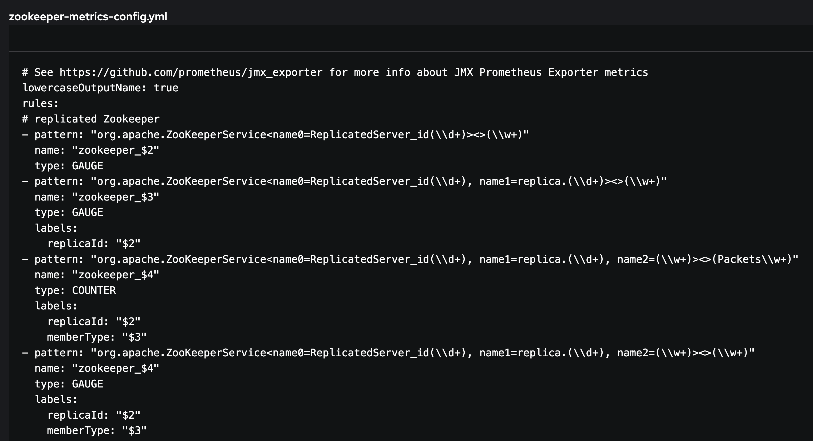
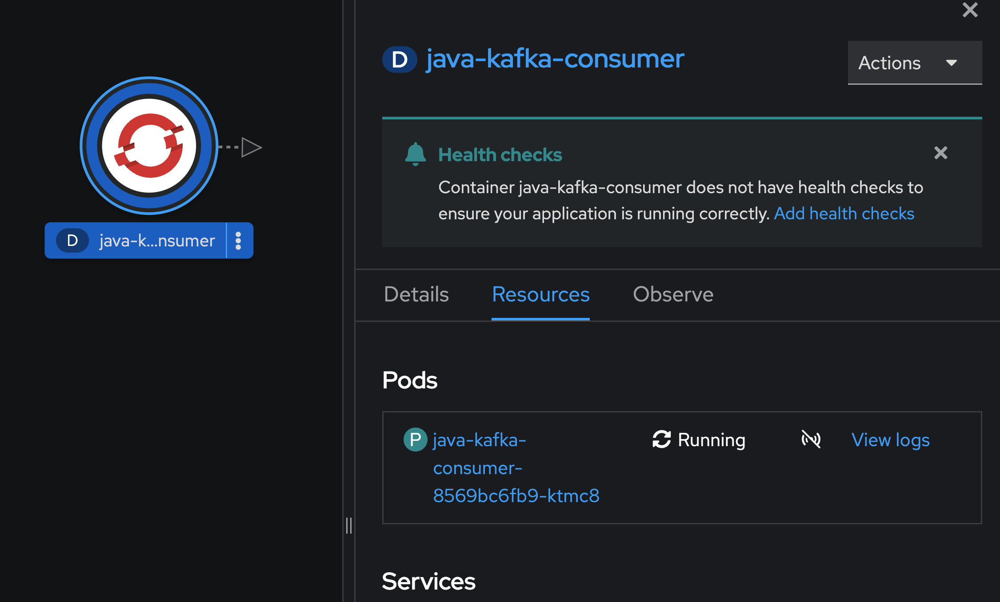

# Advanced Red Hat AMQ Streams on OpenShift


## Login to Red Hat OpenShift Container Platform

- Login to OpenShift Web Console (get URL from instructor)
- Input your username and password (get username/password from instructor)
  
  

- Click skip tour
    
  

- Workshop provide 3 workspace, userX-amqstreams-client, userX-amqstreams-full & userX-amqstreams-quickstart, for this workshop, click 'userX-amqstreams-full' (change userX to you username !!!)
  
  

- after select project 'userX-amqstreams-full' (change userX to you username !!!), select Topology in left menu bar. 

  

## Setup Web Terminal and Git 

- For run command line in this workshop, we will use OpenShift Web Terminal
- From OpenShift Console, click web terminal icon (>_) at top right of web console
  
  

- OpenShift command line terminal will start at buttom of web console, initialize terminal to your project, please select 'userX-amqstreams-full' (change userX to you username !!!), click start button

  

- wait operator deploy terminal pod in your workspace (wait until pod color change to dark blue)

  

- after deployment complete, web terminall will show at buttom of console. 

  

- clone this repository to use in this workshop with git command

  ```sh
  cd ~
  git clone https://github.com/chatapazar/amq-streams-ocp.git
  ```

  

- check content in repository
  
  ```sh
  cd ~/amq-streams-ocp/amq-streams-full
  ls
  ```

  

- Now! we are ready to continue workshop.
  
## Create Advanced AMQ Streams

- Create Metric ConfigMap for Monitor AMQ Streams
- Review ConfigMap in [kafka-metric.yml](./manifest/kafka-metric.yml)

  ```yml
  kind: ConfigMap
  apiVersion: v1
  metadata:
    name: kafka-metrics
    labels:
      app: strimzi
  data:
    kafka-metrics-config.yml: |
      # See https://github.com/prometheus/jmx_exporter for more info about JMX Prometheus Exporter metrics
      lowercaseOutputName: true
      rules:
      # Special cases and very specific rules
      - pattern: kafka.server<type=(.+), name=(.+), clientId=(.+), topic=(.+), partition=(.*)><>Value
        name: kafka_server_$1_$2
        type: GAUGE
        labels:
        clientId: "$3"
        topic: "$4"
        partition: "$5"
  ...
    zookeeper-metrics-config.yml: |
    # See https://github.com/prometheus/jmx_exporter for more info about JMX Prometheus Exporter metrics
    lowercaseOutputName: true
    rules:
    # replicated Zookeeper
    - pattern: "org.apache.ZooKeeperService<name0=ReplicatedServer_id(\\d+)><>(\\w+)"
      name: "zookeeper_$2"
      type: GAUGE
  ...    
  ```
  
  - kafka-metrics-config.yml for prometheus jmx_exporter of Kafka Broker
  - zookeeper-metrics-config.yml for prometheus jmx_exporter of Zookeeper

- Run command create ConfigMap, change userX to your username before run !!!

  ```sh
  oc project userX-amqstreams-full
  cd ~/amq-streams-ocp/amq-streams-full/manifest
  oc apply -f kafka-metric.yml
  ```

  example result

- Reveiw ConfigMap 'kafka-metrics' in Web Console, Click ConfigMaps from left menu bar,

  

- Click ConfigMap 'kafka-metrics' to view details

  

  - kafka-metrics-config.yml for prometheus jmx_exporter of Kafka Broker
    
    

  - zookeeper-metrics-config.yml for prometheus jmx_exporter of Zookeeper
  
    

- Create Kafka Cluster 'my-cluster'
- Review [my-cluster-kafka.yml](./manifest/my-clsuter-kafka.yml)

  ```yml
  apiVersion: kafka.strimzi.io/v1beta2
  kind: Kafka
  metadata:
    name: my-cluster
  spec:
    kafka:
      version: 3.2.3
      replicas: 3
      authorization:
        type: simple
        superUsers:
        - CN=admin-user-tls      
        - admin-user-scram
      listeners:
        - name: plain
          port: 9092
          type: internal
          tls: false
          authentication:
            type: scram-sha-512
        - name: tls
          port: 9093
          type: internal
          tls: true      
          authentication:
            type: tls
        - name: external
          port: 9094
          type: route
          tls: true
          authentication:
            type: tls
      config:
        # specify the message format version the broker will use to append messages to the logs
        log.message.format.version: 3.2.3
        # Specify which version of the inter-broker protocol will be used.
        # This is typically bumped after all brokers were upgraded to a new version.
        inter.broker.protocol.version: 3.2.3
        # default replication factors for automatically created topics
        default.replication.factor: 3
        # The default number of log partitions per topic
        num.partitions: 1
  ...
  ```

  - create kafka cluster name: 'my-cluster'
  - kafka version: 3.2.3
  - replicas: 3
  - set authorization for use in this cluster , set super user
  - open 3 listener (9092 --> sasl_plain with scram-sha-512, 9093 --> ssl ,9094 --> ssl)
  - config for kafka broker

  ```yml
    storage:
      type: jbod
      volumes:
      - id: 0
        type: persistent-claim
        size: 100Gi
        deleteClaim: true
    livenessProbe:
      initialDelaySeconds: 60
      timeoutSeconds: 5
    readinessProbe:
      initialDelaySeconds: 60
      timeoutSeconds: 5
    metricsConfig:
      type: jmxPrometheusExporter
      valueFrom:
        configMapKeyRef:
          name: kafka-metrics
          key: kafka-metrics-config.yml    
  ```

  - set storage type to JBOD (Just a Bunch Of Disks) storage allows you to use multiple disks in each Kafka broker for storing commit logs.
  - metricsconfig for jmxprometheus exporter link to your configmap 

  ```yml
  zookeeper:
    replicas: 3
    storage:
      type: persistent-claim
      size: 100Gi
      deleteClaim: true
    livenessProbe:
      initialDelaySeconds: 60
      timeoutSeconds: 5
    readinessProbe:
      initialDelaySeconds: 60
      timeoutSeconds: 5
    metricsConfig:
      type: jmxPrometheusExporter
      valueFrom:
        configMapKeyRef:
          name: kafka-metrics
          key: zookeeper-metrics-config.yml
  entityOperator:
    topicOperator:
      reconciliationIntervalSeconds: 60
    userOperator:
      reconciliationIntervalSeconds: 60
    tlsSidecar: {}
  kafkaExporter:
    topicRegex: ".*"
    groupRegex: ".*"
  ```

  - config zookeeper
  - config entity operator
  - config kafka exporter for monitor consumer lag

- advance kafka cluster configuration see this link --> https://access.redhat.com/documentation/en-us/red_hat_amq_streams/2.5/html/deploying_and_managing_amq_streams_on_openshift/overview-str
- Run command line to create kafka cluster (change userX to your username before run !!!)

  ```sh 
  oc project userX-amqstreams-full
  cd ~/amq-streams-ocp/amq-streams-full/manifest
  oc apply -f my-cluster-kafka.yml 
  ```

- Wait until all pod in 'my-cluster' kafka change color to dark blue

  

- Review all component in 'my-cluster' kafka
- click 'my-cluster-entity-operator', view detail in property popup
  
  
  
- click 'my-cluster-zookeeper', view detail in property popup  

  

- click 'my-cluster-kafka', view detail in property popup

  

- click 'my-cluster-kafka-exporter', view detail in property popup

  

- Check service of 'my-cluster', click search in left menu bar, in search page, type 'service' in resource dropdownlist and select '(s) services' check box
- View service 'my-cluster-kafka-bootstrap', 'my-cluster-kafka-0', 'my-cluster-kafka-1', 'my-cluster-kafka-2' 

  

- Check route of 'my-cluster', click search in left menu bar, in search page, type 'route' in resource dropdownlist and select '(RT) Routes' check box
- View route 'my-cluster-kafka-bootstrap','my-cluster-kafka-0','my-cluster-kafka-1','my-cluster-kafka-2'

  

- Check PersistentVolumeClaims of 'my-cluster', click search in left menu bar, in search page, type 'pvc' in resource dropdownlist and select '(PVC) PersistentVolumeClaims' check box
- View route 'data-0-my-cluster-kafka-0', 'data-0-my-cluster-kafka-1', 'data-0-my-cluster-kafka-2', 'data-my-cluster-zookeeper-0', 'data-my-cluster-zookeeper-1', 'data-my-cluster-zookeeper-2'

  

## Monitor AMQ Streams with OpenShift User Workload Monitoring

- Enable [OpenShift User Workload Monitoring](https://docs.openshift.com/container-platform/4.8/monitoring/enabling-monitoring-for-user-defined-projects.html) (ready by instructor)
- Create Pod Monitor , review [strimzi-pod-monitor.yaml](../strimzi-0.29.0/examples/metrics/prometheus-install/strimzi-pod-monitor.yaml)

  ```yml
  apiVersion: monitoring.coreos.com/v1
  kind: PodMonitor
  metadata:
    name: cluster-operator-metrics
    labels:
      app: strimzi
  spec:
    selector:
      matchLabels:
        strimzi.io/kind: cluster-operator
    namespaceSelector:
      matchNames:
        - myproject
    podMetricsEndpoints:
    - path: /metrics
      port: http
  ---
  ...
  ```

- Run command line create monitor object for kafka component (zookeeper, kafka, exporter, etc.)
- change 'userX' to your username before run command !!!

  ```sh
  oc project userX-amqstreams-full
  cd ~/amq-streams-ocp/amq-streams-full
  cat ../strimzi-0.29.0/examples/metrics/prometheus-install/strimzi-pod-monitor.yaml | sed "s#myproject#userX-amqstreams-full#g" | oc apply -n userX-amqstreams-full -f -
  ```

  

- Monitor kafka cluster, click Observe in left menu bar

  

- view monitoring dashboard such as cpu usage, cpu quota, memory usage, memory quota, etc.

- Click tab 'Metrics', click select query, select Custom query
  
  

- type 'strimzi' in expression box wait until auto suggestion appear! (wait 2-3 minutes for openshift get metric to user workload monitoring)

  

- select metrics "strimzi_resources" and click enter to call dashboard
  
  

## Monitor Kafka Cluster with Grafana

- Check 'grafan-operator-controller-manager' deploy in your 'userX-amqstreams-full' project (change userX to your username !!!) --> instructor provide this for you

  

- Create grafana, grafan service account, cluster role binding and token for connect  (change 'userX' to your username !!!)
  
  ```bash
  cd ~/amq-streams-ocp/amq-streams-full/manifest
  oc project userX-amqstreams-full
  cat grafana.yml | sed "s#NAMESPACE#userX-amqstreams-full#g" | oc apply -n userX-amqstreams-full -f -
  cat grafana-sa.yml | sed "s#NAMESPACE#userX-amqstreams-full#g" | oc apply -n userX-amqstreams-full -f -
  ```

- Check 'grafana-deployment' deploy in your 'userX-amqstreams-full' project (change userX to your username !!!)

  

- create grafana datasource to OpenShift User Workload Monitoring (thanos)
  
  ```sh
  export TOKEN=$(oc create token --duration=999h -n userX-amqstreams-full grafana-serviceaccount)
  echo $TOKEN
  cat grafana-datasource.yml | sed "s#TOKEN#$TOKEN#g" | oc apply -n userX-amqstreams-full -f -
  ```

- Open Grafana Web UI, click open url link on 'grafana-deployment'

  
  
  

- Click sign in at buttom left, 

  

- login with admin/admin

  

- skip change password

  

- verify data source, select configuration in left menu, select Data Sources

  

- In Data Sources tab, select Prometheus datasource

  

- Review datasource configuration

  

- Click save & test for verify data source is working?

  

- Import Dashboard to Grafana, select Dashboards in left menu, select Manage

  

- In Dashboards, Manage tab, click Import button

  

- Copy dashboard from [strimzi-zookeeper.json](../strimzi-0.29.0/examples/metrics/grafana-dashboards/strimzi-zookeeper.json) , click copy icon (near 'Raw' icon)

  

- Past json in 'Import via panel json' and click load

  

- leave all default value and select Prometheus to 'Prometheus' data source, click Import

  

- Review Zookeeper Dashboard

  

- Repeat again with [strimzi-kafka.json](../strimzi-0.29.0/examples/metrics/grafana-dashboards/strimzi-kafka.json) and [strimzi-kafka-exporter.json](../strimzi-0.29.0/examples/metrics/grafana-dashboards/strimzi-kafka-exporter.json)

- Review Kafka Dashboard
  
  
  
- Review Kafka Exporter Dashboard

  

## Test Kafka with Kafka User

- Reveiw Kafka Topics
  - [mytopic.yml](./manifest/topics/my-topic.yml)
  - [greetings-topic.yml](./manifest/topics/greetings-topic.yml)
  - [greetings-reversed-topic.yml](./manifest/topics/greetings-reversed-topic.yml)

- Review Kafka Users
  - Super User
    - [admin-user-scram.yml](./manifest/users/admin-user-scram.yml) for authen with SASL (scram-sha-512)
    - [admin-user-tls.yml](./manifest/users/admin-user-tls.yml) for authen with TLS/SSL
  - User with ACLs
    - [sample-streams-user-tls.yml](./manifest/users/sample-streams-user-tls.yml) for authen with TLS/SSL with ACLs
    - [sample-user-scram.yml](./manifest/users/sample-user-scram.yml) for authen with SASL (scram-sha-512) & ACLs
    - [sample-user-tls.yml](./manifest/users/sample-user-tls.yml) for authen with TLS/SSL with ACLs

- Example ACLs
  - [sample-user-scram.yml](./manifest/users/sample-user-scram.yml) for authen with SASL (scram-sha-512) & ACLs
  
  ```yaml
  apiVersion: kafka.strimzi.io/v1beta2
  kind: KafkaUser
  metadata:
    name: sample-user-scram
    labels:
      strimzi.io/cluster: my-cluster
  spec:
    authentication:
      type: scram-sha-512
    authorization:
      type: simple
  ...
  ```
  - name: sample-user-scram
  - strimzi.io/cluster: my-cluster --> for kafka cluster 'my-cluster'
  - authenticaiton: scram-sha-512 (SASL)
  
  ```yaml
  ...  
    acls:
    # Consumer Groups
    - resource:
        type: group
        name: test-group
        patternType: literal
      operation: Read
    - resource:
        type: group
        name: sample-group
        patternType: literal
      operation: Read
    - resource:
        type: group
        name: sample-consumer-reversed-group
        patternType: literal
      operation: Read
  ...
  ```

  - set ACL to consumer groups 'test-group' for operation read
  - set ACL to consumer groups 'sample-group' for operation read
  - set ACL to consumer groups 'sample-consumer-reversed-group' for operation read

  ```yaml
  ...
  # Consumer ACLs for topic 
    - resource:
        type: topic
        name: my-topic
        patternType: literal
      operation: Read
    - resource:
        type: topic
        name: my-topic
        patternType: literal
      operation: Describe
    - resource:
        type: topic
        name: my-topic
        patternType: literal
      operation: Write      
  ...
  ```

  - set ACL to topic 'my-topic' for operation read, describe, write

- Run Both Kafkas Topic & Kafka Users with Command Line or Import YAML
  - with command line (change userX to your username before run !!!)

    ```sh
    cd ~/amq-streams-ocp/amq-streams-full/manifest
    oc project userX-amqstreams-full
    oc apply -f topics
    oc apply -f users
    ```

  - with Import YAML
    
    
  
- Recheck Kafka Topic, click search in left menu, type 'topic' in Resources dropdownlist, select check box '(KT) KafkaTopic'
  
  

- View All Topic created.
  
  

- Recheck Kafka User, click search in left menu, type 'kafka' in Resources dropdownlist, select check box '(KU) KafkaUser'
    
  
  
- View All User created.  

  

- Deploy Sample Kafka Producer/Cosnumer, Review Code at https://github.com/strimzi/client-examples
- Review Producer Deployment [01-deployment-producer.yml)](./manifest/01-deployment-producer.yml)
  
  ```yaml
  ...
          - name: java-kafka-producer
          image: quay.io/strimzi-examples/java-kafka-producer:latest
          env:
            - name: STRIMZI_TOPIC
              value: my-topic
            - name: STRIMZI_DELAY_MS
              value: "1000"
            - name: STRIMZI_LOG_LEVEL
              value: "INFO"
            - name: STRIMZI_MESSAGE_COUNT
              value: "1000000"
            - name: KAFKA_BOOTSTRAP_SERVERS
              value: my-cluster-kafka-bootstrap:9093
            - name: KAFKA_KEY_SERIALIZER
              value: "org.apache.kafka.common.serialization.StringSerializer"
            - name: KAFKA_VALUE_SERIALIZER
              value: "org.apache.kafka.common.serialization.StringSerializer"
            - name: KAFKA_SECURITY_PROTOCOL
              value: SSL
            - name: KAFKA_SSL_TRUSTSTORE_CERTIFICATES
              valueFrom:
                secretKeyRef:
                  name: my-cluster-cluster-ca-cert
                  key: ca.crt
            - name: KAFKA_SSL_TRUSTSTORE_TYPE
              value: PEM
            - name: KAFKA_SSL_KEYSTORE_CERTIFICATE_CHAIN
              valueFrom:
                secretKeyRef:
                  name: sample-user-tls
                  key: user.crt
            - name: KAFKA_SSL_KEYSTORE_KEY
              valueFrom:
                secretKeyRef:
                  name: sample-user-tls
                  key: user.key
            - name: KAFKA_SSL_KEYSTORE_TYPE
              value: PEM
  ...
  ```
  - KAFKA_BOOTSTRAP_SERVERS: my-cluster-kafka-bootstrap:9093, connect to tls listener port 9093 (my-cluster-kafka-bootstrap is service in this project)
  - KAFKA_SECURITY_PROTOCOL: SSL
  - KAFKA_SSL_TRUSTSTORE_CERTIFICATES: trustore file --> link to secret 'my-cluster-cluster-ca-cert'
  - KAFKA_SSL_TRUSTSTORE_TYPE: PEM
  - KAFKA_SSL_KEYSTORE_CERTIFICATE_CHAIN: keystore --> link to secret 'user.crt'
  - KAFKA_SSL_KEYSTORE_KEY: keystore key --> link to secret 'user.crt'
  - KAFKA_SSL_KEYSTORE_TYPE: PEM

- Run command to deploy producer, change userX to you username before run !!!

  ```yaml
  oc project userX-amqstreams-full
  cd ~/amq-streams-ocp/amq-streams-full/manifest
  oc apply -f 01-deployment-producer.yml
  ```
  
- Review 'java-kafka-producer' deployment

  

- Review 'java-kafka-producer' Logs, (click pod in resources tab, and select logs tab in Pod details)

  

- Run command to deploy producer, change userX to you username before run !!!
  
  ```yaml
  oc apply -f 02-deployment-consumer.yml
  ```

- Review 'java-kafka-consumer' deployment
  
  
  
- Review 'java-kafka-consumer' Logs, (click pod in resources tab, and select logs tab in Pod details)

  

- Delete producer & consumer deployment with command
  
  ```yaml
  oc delete -f 01-deployment-producer.yml
  oc delete -f 02-deployment-consumer.yml
  ```

## Test Kafka Client with OpenShift Route

- Get TLS/SSL from Kafka Clsuter
- Click Secret from left menu, (see my-cluster-cluster-ca-cert and sample-user-tls)
  
  

- Review secret 'my-cluster-cluster-ca-cert'
  
  

- click tab YAML, click Download to your laptop

  

- Use your editor in your laptop, edit 'my-cluster-cluster-ca-cert.yaml'
  
  -  remove all info in metadata tag except name & namespace and change namespace to userX-amqstreams-client (change userX to your username !!!)

  

- repeat again with secret 'sample-user-tls' (download & edit)

  

- back to openshift console, select project 'userX-amqstreams-client' and click plus icon at top right of openshift console to open Import YAML editor. (change userX to your username !!!)

  

  

- In Import YAML Editor, copy and paste 'my-cluster-cluster-ca-cert' (after edit), click create
  
  

- repeat again with 'sample-user-tls' (after edit)

  

- Recheck both secret created in userX-amqstreams-client project (click secret in left menu)

  


- Review [03-deployment-producer.yml](./manifest/03-deployment-producer.yml) before deploy
  
  ```yaml
      spec:
      containers:
        - name: java-kafka-producer
          image: quay.io/strimzi-examples/java-kafka-producer:latest
          env:
            - name: STRIMZI_TOPIC
              value: my-topic
            - name: STRIMZI_DELAY_MS
              value: "1000"
            - name: STRIMZI_LOG_LEVEL
              value: "INFO"
            - name: STRIMZI_MESSAGE_COUNT
              value: "1000000"
            - name: KAFKA_BOOTSTRAP_SERVERS
              value: KAFKAROUTE:443
            - name: KAFKA_KEY_SERIALIZER
              value: "org.apache.kafka.common.serialization.StringSerializer"
            - name: KAFKA_VALUE_SERIALIZER
              value: "org.apache.kafka.common.serialization.StringSerializer"
            - name: KAFKA_SECURITY_PROTOCOL
              value: SSL
            - name: KAFKA_SSL_TRUSTSTORE_CERTIFICATES
              valueFrom:
                secretKeyRef:
                  name: my-cluster-cluster-ca-cert
                  key: ca.crt
            - name: KAFKA_SSL_TRUSTSTORE_TYPE
              value: PEM
            - name: KAFKA_SSL_KEYSTORE_CERTIFICATE_CHAIN
              valueFrom:
                secretKeyRef:
                  name: sample-user-tls
                  key: user.crt
            - name: KAFKA_SSL_KEYSTORE_KEY
              valueFrom:
                secretKeyRef:
                  name: sample-user-tls
                  key: user.key
            - name: KAFKA_SSL_KEYSTORE_TYPE
              value: PEM
  ```
  
  - KAFKA_BOOTSTRAP_SERVERS: KAFKAROUTE:443 (what is KAFKAROUTE? it is openshift route to kafka cluster, we will get it from command line)

- run command line to deploy producer in userX-amqstreams-client (change userX to your username !!!)
  
  ```sh
  cd ~/amq-streams-ocp/amq-streams-full/manifest
  oc project userX-amqstreams-full
  export KAFKAROUTE=$(oc get route my-cluster-kafka-bootstrap -o jsonpath={.spec.host})
  echo $KAFKAROUTE
  oc project userX-amqstreams-client
  cat 03-deployment-producer.yml | sed "s#KAFKAROUTE#$KAFKAROUTE#g" | oc apply -n userX-amqstreams-client -f -
  cat 04-deployment-consumer.yml | sed "s#KAFKAROUTE#$KAFKAROUTE#g" | oc apply -n userX-amqstreams-client -f -
  ```

- Review producer & consumer in userX-amqstreams-client project

  

  

  

  

- Delete producer & consumer deployment with web console, select deployment and click action menu, select delete deployment, confirm delete

  

  

  

## Test Kafka Streams with AMQ Strams

- Review Example Kafka Strams Java Code [KafkaStreamsExample.java](https://github.com/strimzi/client-examples/blob/main/java/kafka/streams/src/main/java/io/strimzi/kafka/streams/KafkaStreamsExample.java)
- Review Example Kafka Streams Deployment [06-deployment-streams.yml](./manifest/06-deployment-streams.yml)

- Message Flow for This Example
  - producer --> Kafka Topic : apps.samples.greetings --> Kafka Stream (Reverse Message) --> Kafka Topic : apps.samples.greetings.reversed --> consumer

- Back to userX-amqstreams-full again, click Topology view at left menu 

  

- Run Command Line to deploy amq streams (change userX to your username before run !!!)
  
  ```sh
  cd ~/amq-streams-ocp/amq-streams-full/manifest
  oc project userX-amqstreams-full
  oc apply -f 05-deployment-producer.yml
  oc apply -f 06-deployment-streams.yml
  oc apply -f 07-deployment-consumer.yml
  ```

- Review Producer
     
  
  
  

- Review Kafka Stream
  
  
  
  
  
- Review Consumer
  
  
  
  

