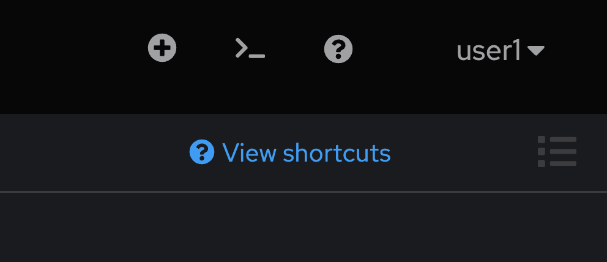

# Advanced Red Hat AMQ Streams on OpenShift

## Login to Red Hat OpenShift Container Platform

- Login to OpenShift Web Console (get URL from instructor)
- Input your username and password (get username/password from instructor)
  
  

- Click skip tour
    
  

- Workshop provide 2 workspace, userX-amqstreams-full & userX-amqstreams-quickstart, for this workshop, click 'userX-amqstreams-full'
  
  

- after select project 'userX-amqstreams-full', select Topology in left menu bar. 

  

## Setup Web Terminal and Git 

- a
  
  
  
  
  
  