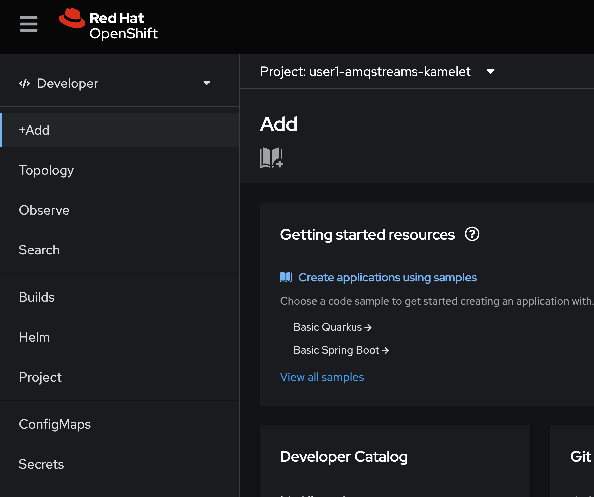
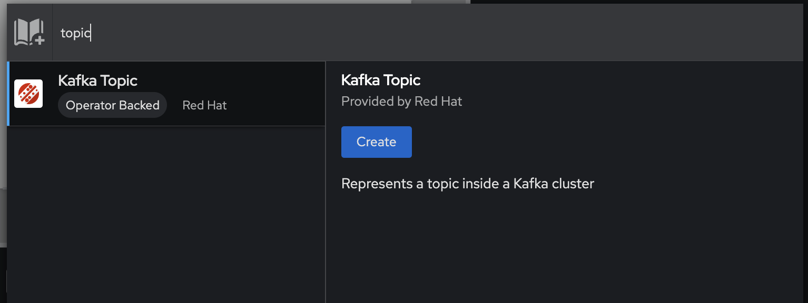
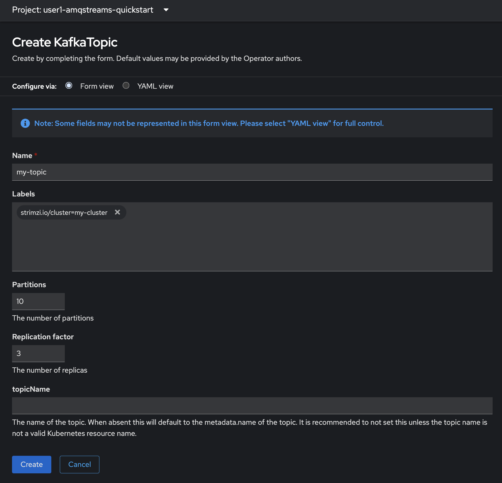
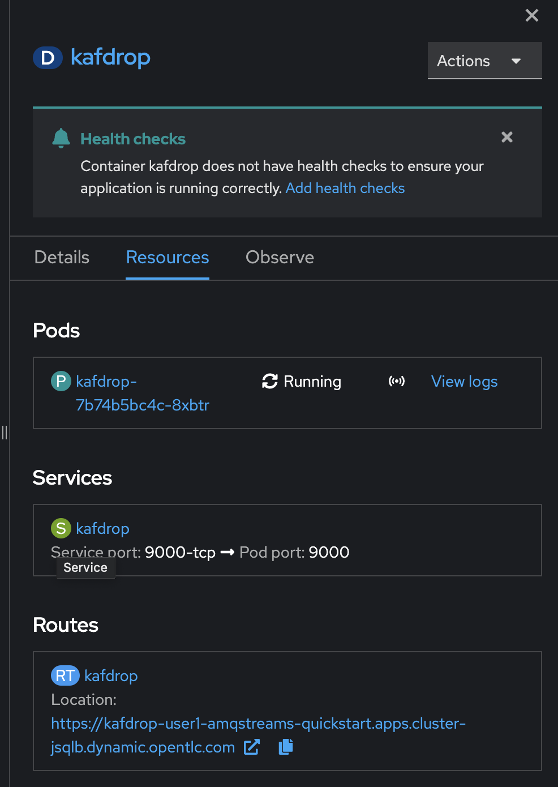

# Red Hat AMQ Streams on OpenShift & Camel K (Kamelet)
- Apache Kafka has become the streaming technology of choice for this type of replication. Kafka is prized by these teams for performance, scalability, and ability to replay streams so that the teams can reset their intermediate stores to any point in time.
- The Red Hat® AMQ streams component is a massively scalable, distributed, and high-performance data streaming platform based on the Apache Kafka project. It offers a distributed backbone that allows microservices and other applications to share data with high throughput and low latency. 
- As more applications move to Kubernetes and Red Hat OpenShift® , it is increasingly important to be able to run the communication infrastructure on the same platform. Red Hat OpenShift, as a highly scalable platform, is a natural fit for messaging technologies such as Kafka. The AMQ streams component makes running and managing Apache Kafka OpenShift native through the use of powerful operators that simplify the deployment, configuration, management, and use of Apache Kafka on Red Hat OpenShift.
- The AMQ streams component is part of the Red Hat AMQ family, which also includes the AMQ broker, a longtime innovation leader in Java™ Message Service (JMS) and polyglot messaging, as well as the AMQ interconnect router, a wide-area, peer-to-peer messaging solution.
- Red Hat Integration - Camel K is a lightweight integration framework that runs natively on OpenShift and is specifically designed for serverless and microservice architectures. Users of Camel K can instantly run integration code written in Camel DSL on their preferred cloud.
- Kamelets are high-level connectors that can serve as building blocks in an event driven architecture solution. They are custom resources that you can install on an OpenShift cluster and use in Camel K integrations. Kamelets accelerate your development efforts. They simplify how you connect data sources (that emit events) and data sinks (that consume events). Because you configure kamelet parameters rather than writing code, you do not need to be familiar with the Camel DSL to use kamelets.

- Fintal Workshop Topology
  
  

## Login to Red Hat OpenShift Container Platform

- Login to OpenShift Web Console (get URL from instructor)
- Input your username and password (get username/password from instructor)
  
  

- Click skip tour
    
  

- Workshop provide workspace 'userX-amqstreams-kamelet' for this workshop, click 'userX-amqstreams-kamelet' (change userX to your username such as 'user1')
  
  

- after select project 'userX-amqstreams-kamelet', select Topology in left menu bar. 

  

## Create Kafka Cluster

- In Topology view, click 'Add to Project' (book icon) to add Kafka Cluster to this project

  

- type 'kafka' in search box, select 'Kafka' from result and click create button
  
  

- In Create Kafka Screen, select configure via: From view, input value for create Kafka Clsuter
  
  - leave default value

  

- change configure via to YAML view, see detail in yaml format (leave default)
  - name: my-cluster
  - namespace: userX-amqstreams-kamelet (change userX to your username)
  - kafka configuration
    - open listener 'plain' at port 9092
    - open listener 'tls' at port 9093 with tls
    - storage type: ephemeral (no persistence volume)
    - version: 3.2.3
    - replicas: 3
    - config: --> kafka broker configuration see this link https://kafka.apache.org/documentation/#brokerconfigs
  - zookeeper configuration
    - storage type: ephemeral
    - replicas: 3
  - advance kafka cluster configuration see this link --> https://access.redhat.com/documentation/en-us/red_hat_amq_streams/2.5/html/deploying_and_managing_amq_streams_on_openshift/overview-str

  

- Click Create and Wait Until all deployment change color to dark blue
    
    

- view Entity Operator, click 'my-cluster-entity-operator' deployment
  - in deployment view, resources tab, have 1 pod of entity operator
  - The Entity Operator is responsible for managing Kafka-related entities in a running Kafka cluster. It comprises the following operators: 
    - Topic Operator to manage Kafka topics and 
    - User Operator to manage Kafka users.

  

- view Zookeeper, click 'my-cluster-zookeeper' statefullset
  - in deployment view, resources tab, have 3 pod of zookeeper, 2 services(my-cluster-zookeeper-client and my-cluster-zookeeper-nodes)
  - ZooKeeper handles the leadership election of Kafka brokers and manages service discovery as well as cluster topology so each broker knows when brokers have entered or exited the cluster, when a broker dies and who the preferred leader node is for a given topic/partition pair. It also tracks when topics are created or deleted from the cluster and maintains a topic list. In general, ZooKeeper provides an in-sync view of the Kafka cluster. (summary zookeeper handle controller election, cluster membership, topic configuration, access control lists, quotas,etc.)
  
  

- view Kafka, click 'my-cluster-kafka' statefullset
  - in deployment view, resources tab, have 3 pod of kafka, 2 services (my-cluster-kafka-brokers, my-cluster-kafka-bootstrap)
  - The Kafka broker handles all requests from all clients (both producers and consumers as well metadata). It also manages replication of data across a cluster as well as within topics and partitions.
    
  

## Create Kafka Topic

- A Kafka topic is a grouping of messages that is used to organize messages for production and consumption. A producer places messages or records onto a given topic, then a consumer reads that record from the same topic. A topic is further broken down into partitions that house a number of records, each identified as a unique offset in a partition log.  

- From Topology view, click 'Add to Project' (book icon) to add Kafka topic to this project 
  
    

- type 'topic' in search box, select 'Kafka Topic' from result and click create button
  
    

- In Create Kafka Topic Screen, select configure via: From view, input value for create Kafka Clsuter
  - leave all default value
  
    

- change configure via to YAML view, see detail in yaml format (leave default value)
  - name: my-topic
  - namespace: userX-amqstreams-kamelet (change userX to your username)
  - partitions: 10
  - replicas: 3
  - config: --> kafka topic configuration see this link --> https://kafka.apache.org/documentation/#topicconfigs
  - advance Kafka Topic Configuration see this link --> https://access.redhat.com/documentation/en-us/red_hat_amq_streams/2.5/html/deploying_and_managing_amq_streams_on_openshift/overview-str

  

- Click create button, 
- Check Kafka Topic, click search in left menu bar, 
  
  

- In search view, click dropdown Resources, type 'topic' and select check box 'KafkaTopic' 

  

- In result of search view, check Kafka Topic 'my-topic' created.
      
  

## View Kafka Information with 3rd Party Web UI

- Example 3rd Party Kafka Web UI
  - [Kafdrop](https://github.com/obsidiandynamics/kafdrop)
  - [AKHQ](https://akhq.io/)  
  - [Quarkus Kafka Dev UI](https://quarkus.io/guides/kafka-dev-ui)
  - [Kafka-ui](https://github.com/provectus/kafka-ui)
  
## View Kafka Cluster with Kafdrop

- Click '+Add' in left menu
    
  

- In Add view, Click deploy with Container images,

    

- In Deploy Image wizard, select Image name from external registry, type 'obsidiandynamics/kafdrop', wait until show 'Validated' 
   
  

- change runtime icon to 'amq' (optional!)
  
  

- In General view, set values to
  - Application: 'Create application'
  - Application name: 'kafdrop'
  - Name: 'kafdrop'
  - Resource type: 'Deployment'
  
  

- In Deploy section, click show advanced deployment option, set values to
  - Target port: 9000
  - select check box 'Create a route'
  - click 'Deployment' Link 
  
  

- In Deployment view, set Environment variables for this deployment
  - Name: KAFKA_BROKERCONNECT
  - Value: my-cluster-kafka-bootstrap:9092
  
  

- Click Create Button, wait until kafdrop deployment color change to dark blue
  
  

- select kafdrop deployment, click Open URL link to open kafdrop

  

- or click route kafdrop from kafdrop property in resources tab
  
  

- view Kafka Cluster Information in Kafdrop, Overview, Brokers, Topics 

  

- click topic 'my-topic' to set topic detail, partition detail
  
  

- click view messages to view message in topic 'my-topic'
  
  

## Test Kafka Cluster with Camel K (Kamelet)

- You can use kamelets to configure communication between Kafka and external resources. Kamelets allow you to configure how data moves from one endpoint to another in a Kafka stream-processing framework without writing code. Kamelets are route templates that you configure by specifying parameter values.

- For example, Kafka stores data in a binary form. You can use kamelets to serialize and deserialize the data for sending to, and receiving from, external connections. With kamelets, you can validate the schema and make changes to the data, such as adding to it, filtering it, or masking it. Kamelets can also handle and process errors.

- If you use an Apache Kafka, you can use kamelets to connect services and applications to a Kafka topic. The Kamelet Catalog provides the following kamelets specifically for making connections to a Kafka topic:

  - kafka-sink - Moves events from a data producer to a Kafka topic. In a kamelet binding, specify the kafka-sink kamelet as the sink.
  - kafka-source - Moves events from a Kafka topic to a data consumer. In a kamelet binding, specify the kafka-source kamelet as the source.

- below figure illustrates the flow of connecting source and sink kamelets to a Kafka topic.
  
  
  
### Kafka-sink wih Kamelet

- From Developer Perspective, Click plus icon at top right of console to open import yaml editor.

  

- Input Kamelet 'coffee-source' to your project for get coffee information from random-data-api.com (REST API)
- paste below yaml to Import 

  ```yaml
  apiVersion: camel.apache.org/v1alpha1
  kind: Kamelet
  metadata:
    name: coffee-source
    labels:
      camel.apache.org/kamelet.type: "source"
  spec:
    definition:
      title: "Coffee Source"
      description: "Retrieve a random coffee from a catalog of coffees"
      properties:
        period:
          title: Period
          description: The interval between two events in seconds
          type: integer
          default: 1000
    types:
      out:
        mediaType: application/json
    template:
      from:
        uri: timer:tick
        parameters:
          period: "{{period}}"
        steps:
        - to: "https://random-data-api.com/api/coffee/random_coffee"
        - to: "kamelet:sink"

  ```

  

- click create button to create kamelet 'coffe-source'
- view Kamelet 'coffee-srource' change status to 'Ready' status
  
  

- Create KameletBinding 'coffees-to-kafka' to get data from kamelet 'coffee-source' to kafka cluster 'my-cluster', topic 'my-topic'
- Click plus icon at top right of console to open import yaml editor again.
- paste below yaml to Import 

  ```yaml
  apiVersion: camel.apache.org/v1alpha1
  kind: KameletBinding
  metadata:
    name: coffees-to-kafka
  spec:
    source:
      ref:
        kind: Kamelet
        apiVersion: camel.apache.org/v1alpha1
        name: coffee-source
      properties:
        period: 5000
    sink:
      ref:
        kind: Kamelet
        apiVersion: camel.apache.org/v1alpha1
        name: kafka-sink
      properties:
        bootstrapServers: "my-cluster-kafka-bootstrap:9092"
        password: "testpassword"
        topic: "my-topic"
        user: "testuser"
        securityProtocol: "PLAINTEXT"
  ```

  

- click create button and wait until KameletBinding 'kafka-to-log' change status to 'Ready' status
  
- Back to Topology View, see update in canvas (new camel icon pod in topology)

  

- check data in kafka, open kafdrop from route or link on pod, click my-topic, see size in partition detail

  

- select partiton (size > 0), and view message (coffee data) in partion

  

- OK! complete kafka-sink with Kamelet, next step create kafka-source with Kamelet  

### Kafka-source wih Kamelet
- Create KameletBinding 'kafka-to-log' to get data from kafka cluster 'my-cluster', topic 'my-topic' to log console
- Click plus icon at top right of console to open import yaml editor again.
- paste below yaml to Import 

  ```yaml
  apiVersion: camel.apache.org/v1alpha1
  kind: KameletBinding
  metadata:
    name: kafka-to-log
  spec:
    source:
      ref:
        kind: Kamelet
        apiVersion: camel.apache.org/v1alpha1
        name: kafka-source
      properties:
        bootstrapServers: "my-cluster-kafka-bootstrap:9092"
        password: "testpassword"
        topic: "my-topic"
        user: "testuser"
        securityProtocol: "PLAINTEXT" 
    sink:
      ref:
        kind: Kamelet
        apiVersion: camel.apache.org/v1alpha1
        name: log-sink
      properties:
        showStreams: true
  ```

  

- click create and wait until 'kafka-to-log' KameletBinding change status to ready

  

- Click Toplogy View, see new (camel) pod 'kafka-to-log'

  

- Click 'kafka-to-log' pod, view side panel, click View logs linke to view container log  

  

- In Log view, see coffee data from kafka

    

## Complete AMQ Streams & Camel K (Kamelet) Workshop!