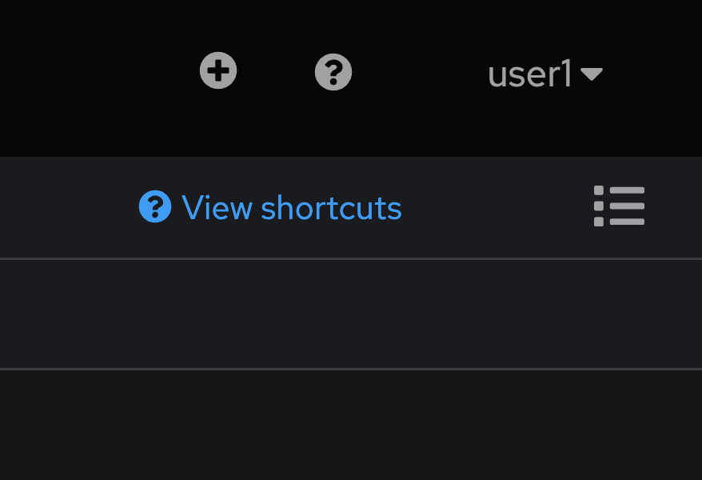

# Red Hat AMQ Streams Quickstart
- Apache Kafka has become the streaming technology of choice for this type of replication. Kafka is prized by these teams for performance, scalability, and ability to replay streams so that the teams can reset their intermediate stores to any point in time.
- The Red Hat® AMQ streams component is a massively scalable, distributed, and high-performance data streaming platform based on the Apache Kafka project. It offers a distributed backbone that allows microservices and other applications to share data with high throughput and low latency. 
- As more applications move to Kubernetes and Red Hat OpenShift® , it is increasingly important to be able to run the communication infrastructure on the same platform. Red Hat OpenShift, as a highly scalable platform, is a natural fit for messaging technologies such as Kafka. The AMQ streams component makes running and managing Apache Kafka OpenShift native through the use of powerful operators that simplify the deployment, configuration, management, and use of Apache Kafka on Red Hat OpenShift.
- The AMQ streams component is part of the Red Hat AMQ family, which also includes the AMQ broker, a longtime innovation leader in Java™ Message Service (JMS) and polyglot messaging, as well as the AMQ interconnect router, a wide-area, peer-to-peer messaging solution.


- Fintal Workshop Topology
  
  

## Login to Red Hat OpenShift Container Platform

- Login to OpenShift Web Console (get URL from instructor)
- Input your username and password (get username/password from instructor)
  
  

- Click skip tour
    
  

- Workshop provide 2 workspace, userX-amqstreams-full & userX-amqstreams-quickstart, for this workshop, click 'userX-amqstreams-quickstart'
  
  

- after select project 'userX-amqstreams-quickstart', select Topology in left menu bar. 

  

## Create Kafka Cluster

- In Topology view, click 'Add to Project' (book icon) to add Kafka Cluster to this project

  

- type 'kafka' in search box, select 'Kafka' from result and click create button
  
  

- In Create Kafka Screen, select configure via: From view, input value for create Kafka Clsuter
  
  - leave default value

  

- change configure via to YAML view, see detail in yaml format
  - name: my-cluster
  - namespace: userX-amqstreams-quickstart (change userX to your username)
  - kafka configuration
    - open listener 'plain' at port 9092
    - open listener 'tls' at port 9093 with tls
    - storage type: ephemeral (no persistence volume)
    - version: 3.2.3
    - replicas: 3
    - config: --> kafka broker configuration see this link https://kafka.apache.org/documentation/#brokerconfigs
  - zookeeper configuration
    - storage type: ephemeral
    - replicas: 3
  - advance kafka cluster configuration see this link --> https://access.redhat.com/documentation/en-us/red_hat_amq_streams/2.5/html/deploying_and_managing_amq_streams_on_openshift/overview-str

  

- Click Create and Wait Until all deployment change color to dark blue
    
    

- view Entity Operator, click 'my-cluster-entity-operator' deployment
  - in deployment view, resources tab, have 1 pod of entity operator
  - The Entity Operator is responsible for managing Kafka-related entities in a running Kafka cluster. It comprises the following operators: 
    - Topic Operator to manage Kafka topics and 
    - User Operator to manage Kafka users.

  

- view Zookeeper, click 'my-cluster-zookeeper' statefullset
  - in deployment view, resources tab, have 3 pod of zookeeper, 2 services(my-cluster-zookeeper-client and my-cluster-zookeeper-nodes)
  - ZooKeeper handles the leadership election of Kafka brokers and manages service discovery as well as cluster topology so each broker knows when brokers have entered or exited the cluster, when a broker dies and who the preferred leader node is for a given topic/partition pair. It also tracks when topics are created or deleted from the cluster and maintains a topic list. In general, ZooKeeper provides an in-sync view of the Kafka cluster. (summary zookeeper handle controller election, cluster membership, topic configuration, access control lists, quotas,etc.)
  
  

- view Kafka, click 'my-cluster-kafka' statefullset
  - in deployment view, resources tab, have 3 pod of kafka, 2 services (my-cluster-kafka-brokers, my-cluster-kafka-bootstrap)
  - The Kafka broker handles all requests from all clients (both producers and consumers as well metadata). It also manages replication of data across a cluster as well as within topics and partitions.
    
  

## Create Kafka Topic

- A Kafka topic is a grouping of messages that is used to organize messages for production and consumption. A producer places messages or records onto a given topic, then a consumer reads that record from the same topic. A topic is further broken down into partitions that house a number of records, each identified as a unique offset in a partition log.  

- From Topology view, click 'Add to Project' (book icon) to add Kafka topic to this project 
  
    

- type 'topic' in search box, select 'Kafka Topic' from result and click create button
  
    

- In Create Kafka Topic Screen, select configure via: From view, input value for create Kafka Clsuter
  - leave all default value
  
    

- change configure via to YAML view, see detail in yaml format
  - name: my-topic
  - namespace: userX-amqstreams-quickstart (change userX to your username)
  - partitions: 10
  - replicas: 3
  - config: --> kafka topic configuration see this link --> https://kafka.apache.org/documentation/#topicconfigs
  - advance Kafka Topic Configuration see this link --> https://access.redhat.com/documentation/en-us/red_hat_amq_streams/2.5/html/deploying_and_managing_amq_streams_on_openshift/overview-str

  

- Click create button, 
- Check Kafa Topic, click search in left menu bar, 
  
  

- In search view, click dropdown Resources, type 'topic' and select check box 'KafkaTopic' 

  

- In result of search view, check Kafka Topic 'my-topic' created.
      
  

## Test Kafka Cluster Work!

- Back to Topology view, click 'my-kafka-cluster' statefullset
  
  

- In 'my-kafka-cluster' statefullset, select 'my-cluster-kafka-0' pod in Pods Resources (or another pod, up to you :D)
  
  

- In Pod Details, click Terminal Tab

  

- In terminal tab of 'my-cluster-kafka-0' pod, wait until shell command ready!
  
  

- check file structure in kafka pod
  
  ```bash
  cd /
  ls
  ```

  example result
  
  

- check kafka command in kafka pod
  
  ```bash
  cd /opt/kafka/bin
  ls
  ```
  
  example result
  
  

- view kafka topic with command line, type below command in terminal
  
  ```bash
  ./kafa-topics.sh --bootstrap-server localhost:9092 --list
  ```
  
  example result

  

- view detail of 'my-topic' with command line
  
  ```bash
  ./kafka-topics.sh --bootstrap-server localhost:9092 --describe --topic my-topic
  ```
  
  example result
  
  

- test push message to topic 'my-topic' with command line
  
  ```bash
  ./kafka-console-producer.sh --bootstrap-server localhost:9092 --topic my-topic
  >first message
  >second message
  >third message
  ```
  
  example result

  

- type ctrl+c to exit from producer console
- test get/consume message from topic 'my-topic' with command line
  
  ```bash
  ./kafka-console-consumer.sh --bootstrap-server localhost:9092 --topic my-topic --from-beginning
  ```

  example result

  

- type ctrl+c to exit from consumer console
- test get/consume message and metadata from topic 'my-topic' with command line

  ```bash
  ./kafka-console-consumer.sh --bootstrap-server localhost:9092 --topic my-topic --from-beginning --property print.offset=true --property print.partition=true --property print.headers=true --property print.timestamp=true --property print.key=true --property print.timestamp=true
  ```
  
  example result
  
  

- type ctrl+c to exit from consumer console
  
## View Kafka Information with 3rd Party Web UI

- Example 3rd Party Kafka Web UI
  - [Kafdrop](https://github.com/obsidiandynamics/kafdrop)
  - [AKHQ](https://akhq.io/)  
  - [Quarkus Kafka Dev UI](https://quarkus.io/guides/kafka-dev-ui)
  - [Kafka-ui](https://github.com/provectus/kafka-ui)
  
## View Kafka Cluster with Kafdrop

- Click '+Add' in left menu
    
  

- In Add view, Click deploy with Container images,

    

- In Deploy Image wizard, select Image name from external registry, type 'obsidiandynamics/kafdrop', wait until show 'Validated' 
   
  

- change runtime icon to 'amq' (optional!)
  
  

- In General view, set values to
  - Application: 'Create application'
  - Application name: 'kafdrop'
  - Name: 'kafdrop'
  - Resource type: 'Deployment'
  
  

- In Advanced options view, set values to
  - Target port: 9000
  - select check box 'Create a route'
  - click 'Deployment' Link 
  
  

- In Deployment view, set Environment variables for this deployment
  - Name: KAFKA_BROKERCONNECT
  - Value: my-cluster-kafka-bootstrap:9092
  
  

- Click Create Button, wait until kafdrop deployment color change to dark blue
  
  

- select kafdrop deployment, click Open URL link to open kafdrop

  

- or click route kafdrop from kafdrop property in resources tab
  
  

- view Kafka Cluster Information in Kafdrop, Overview, Brokers, Topics 

  

- click topic 'my-topic' to set topic detail, partition detail
  
  

- click view messages to view message in topic 'my-topic'
  
  

## Test Kafka Cluster with Producer/Consumer application on OpenShift

- Client-Example soruce code --> https://github.com/strimzi/client-examples
- Review Producer Example Application Code
  - [KafkaProducerExample.java](https://github.com/strimzi/client-examples/blob/main/java/kafka/producer/src/main/java/io/strimzi/kafka/producer/KafkaProducerExample.java)
  - [KafkaProducerConfig.java](https://github.com/strimzi/client-examples/blob/main/java/kafka/producer/src/main/java/io/strimzi/kafka/producer/KafkaProducerConfig.java) 
  - [Dockerfile](https://github.com/strimzi/client-examples/blob/main/java/kafka/producer/Dockerfile) 

- Review Consumer Example Application Code
  - [KafkaConsumerExample.java]([KafkaConsumerExample.java](https://github.com/strimzi/client-examples/blob/main/java/kafka/consumer/src/main/java/io/strimzi/kafka/consumer/KafkaConsumerExample.java))
  - [KafkaConsumerConfig.java](https://github.com/strimzi/client-examples/blob/main/java/kafka/consumer/src/main/java/io/strimzi/kafka/consumer/KafkaConsumerConfig.java)
  - [Dockerfile](https://github.com/strimzi/client-examples/blob/main/java/kafka/consumer/Dockerfile)
  
- Deploy Producer Example Application to OpenShift, Click Plus icon at top right of OpenShift Console
  
  

- In Import YAML Console, type deployment yaml from [01-quick-deployment-producer.yml](./manifest/01-quick-deployment-producer.yml) or copy from below to Import YAML editor.
  
  ```YAML
  apiVersion: apps/v1
  kind: Deployment
  metadata:
    labels:
      app: quick-java-kafka-producer
    name: quick-java-kafka-producer
  spec:
    replicas: 1
    selector:
      matchLabels:
        app: quick-java-kafka-producer
    template:
      metadata:
        labels:
          app: quick-java-kafka-producer
      spec:
        containers:
          - name: quick-java-kafka-producer
            image: quay.io/strimzi-examples/java-kafka-producer:latest
            env:
              - name: STRIMZI_TOPIC
                value: my-topic
              - name: STRIMZI_DELAY_MS
                value: "1000"
              - name: STRIMZI_LOG_LEVEL
                value: "INFO"
              - name: STRIMZI_MESSAGE_COUNT
                value: "1000000"
              - name: KAFKA_BOOTSTRAP_SERVERS
                value: my-cluster-kafka-bootstrap:9092
              - name: KAFKA_KEY_SERIALIZER
                value: "org.apache.kafka.common.serialization.StringSerializer"
              - name: KAFKA_VALUE_SERIALIZER
                value: "org.apache.kafka.common.serialization.StringSerializer"
  ```
    
  example result

  

  Detail of this yaml
  
  - image: quay.io/strimzi-examples/java-kafka-producer:latest
  - environment variable for producer
    - STRIMZI_TOPIC: my-topic, topic for producer
    - STRIMZI_DELAY_MS: "1000", How long before sending the next message?
    - STRIMZI_LOG_LEVEL: "INFO", Log Level
    - STRIMZI_MESSAGE_COUNT: "1000000", number of send message
    - KAFKA_BOOTSTRAP_SERVERS: my-cluster-kafka-bootstrap:9092, service name of kafka bootstrap
    - KAFKA_KEY_SERIALIZER: "org.apache.kafka.common.serialization.StringSerializer"
    - KAFKA_VALUE_SERIALIZER: "org.apache.kafka.common.serialization.StringSerializer"
    
- Click Create, and wait until pod start complete (change to 1 Pod and color change to dark blue)
    
    

- change to Pods Tab, see Pod Detail, click 'quick-java-kafka-producer-xxx' pod
  
    

- In Pod Details, click Logs Tab

    

- View Logs, see 'Sending messages "Hello world - x"' 
  
    

- Click Plus icon at top right of OpenShift Console again
  
  

- In Import YAML Console, type deployment yaml from [02-quick-deployment-consumer.yml](./manifest/02-quick-deployment-consumer.yml) or copy from below to Import YAML editor.
  
  ```YAML
  apiVersion: apps/v1
  kind: Deployment
  metadata:
    labels:
      app: quick-java-kafka-consumer
    name: quick-java-kafka-consumer
  spec:
    replicas: 1
    selector:
      matchLabels:
        app: quick-java-kafka-consumer
    template:
      metadata:
        labels:
          app: quick-java-kafka-consumer
      spec:
        containers:
          - name: quick-java-kafka-consumer
            image: quay.io/strimzi-examples/java-kafka-consumer:latest
            env:
              - name: STRIMZI_TOPIC
                value: my-topic
              - name: STRIMZI_LOG_LEVEL
                value: "INFO"
              - name: STRIMZI_MESSAGE_COUNT
                value: "1000000"
              - name: KAFKA_BOOTSTRAP_SERVERS
                value: my-cluster-kafka-bootstrap:9092
              - name: KAFKA_GROUP_ID
                value: test-group
              - name: KAFKA_KEY_DESERIALIZER
                value: "org.apache.kafka.common.serialization.StringDeserializer"
              - name: KAFKA_VALUE_DESERIALIZER
                value: "org.apache.kafka.common.serialization.StringDeserializer"
  
  ```

  example result

  

  Detail of this yaml
  
  - image: quay.io/strimzi-examples/java-kafka-consumer:latest
  - environment variable for consumer
    - STRIMZI_TOPIC: my-topic, topic for consumer
    - STRIMZI_LOG_LEVEL: "INFO", Log Level
    - STRIMZI_MESSAGE_COUNT: "1000000", number of receive message
    - KAFKA_BOOTSTRAP_SERVERS: my-cluster-kafka-bootstrap:9092, service name of kafka bootstrap
    - KAFKA_KEY_SERIALIZER: "org.apache.kafka.common.serialization.StringSerializer"
    - KAFKA_VALUE_SERIALIZER: "org.apache.kafka.common.serialization.StringSerializer"
    - KAFKA_GROUP_ID: test-group, consumer group name
   
- Click Create, and wait until pod start complete (change to 1 Pod and color change to dark blue)
  
    

- change to Pods Tab, see Pod Detail, click 'quick-java-kafka-consumer-xxx' pod
  
    

- In Pod Details, click Logs Tab
  
    

- View Logs, see 'Received messages'
  
    

- Back to Topology view
  
    

- View Topic 'my-topic' with kafkdrop
  
    

- view Consumers 'test-group' in kafdrop
  
    

## Complete Quickstart Workshop!