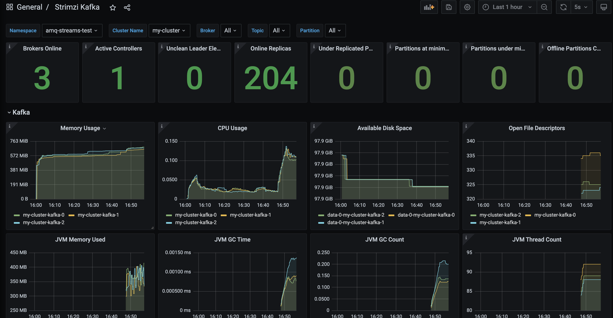

# Basic AMQ Streams on OCP

## Install Red Hat AMQ Streams 2.2 Operator (recommend version 2.2 for LTS)

- Go to Openshift Console, Operator Hub, Search "AMQ Streams"
  
    

- Select AMQ Streams porvided by Red Hat

    

- Click Install    

    

- Wait Until Install Complete

    

    

## New AMQ Streams Cluster in OpenShift Project

- login to openshift & create project "amq-streams-test"

    ```bash
    cd amq-streams-test
    oc login # input --insecure-skip-tls-verify for self cert 
    oc new-project amq-streams-test
    ```

- Create Metric ConfigMap, Kafka Cluster, Kafka Topic and Kafka User

    ```bash
    oc apply -f kafka-metric.yml
    oc apply -f my-clsuter-kafka.yml 
    oc apply -f topics/
    oc apply -f users/
    ```

- View Kafka Cluster

  

- View Kafka Topics
  
  

- View Kafka Users
  
  

## Create Monitoring for AMQ Streams

- Create Grafana Project, install grafana operator

    ```bash
    oc new-project streams-grafana
    oc delete limitranges --all -n streams-grafana
    oc apply -f operator-group.yml -n streams-grafana
    oc apply -f grafana-subscription.yml -n streams-grafana
    oc get pods -n streams-grafana
    ```

- View Grafana Operator Install Complete!
  
  

- Create application workload monitoring configmap

    ```bash
    oc apply -f user-workload-monitoring.yml
    oc get po -n openshift-user-workload-monitoring
    ```

- wait until all pod running

    ```bash
    NAME                                  READY   STATUS    RESTARTS   AGE
    prometheus-operator-cf59f9bdc-zmw4v   2/2     Running   0          3h16m
    prometheus-user-workload-0            6/6     Running   0          3h16m
    prometheus-user-workload-1            6/6     Running   0          3h16m
    thanos-ruler-user-workload-0          4/4     Running   0          3h16m
    thanos-ruler-user-workload-1          4/4     Running   0          3h16m
    ```

- create monitor service for kafka component (zookeeper, kafka, exporter, etc.)

    ```bahs
    cat ../strimzi-0.29.0/examples/metrics/prometheus-install/strimzi-pod-monitor.yaml | sed "s#myproject#amq-streams-test#g" | oc apply -n amq-streams-test -f -
    ```

- check metrics "strimzi_resources" in project amq-streams-test, observe menu, metrics, custom query (wait 2-3 minutes for openshift get metric to user workload monitoring)

    

- create grafana, service account, cluster role binding and token for connect 
  
    ```bash
    oc apply -f grafana.yml
    oc apply -f grafana-sa.yml
    oc apply -f grafana-crb.yml
    export TOKEN=$(oc create token --duration=999h -n streams-grafana grafana-serviceaccount)
    echo $TOKEN
    ```

- create grafana datasource to thanos
  
    ```bash
    cat grafana-datasource.yml | sed "s#TOKEN#$TOKEN#g" | oc apply -n streams-grafana -f -
    ```

- open grafana web ui in streams-grafana
  
  

- user: admin/admin

  

- test datasources

  

  

- import dashboard (kafka, zookeeper, exporter) from strimzi-0.29.0/examples/metrics/grafana-dashboards download folder
  
  

  

- View Zookeeper Monitor
  
  

- View Kafka Monitor
  
  

- Veiw Kafka Exporter Monitor
    
  

## AMQ Streams Test Client

- Create Producer & Consumer with my-topic Topic

    ```bash
    oc project amq-streams-test
    oc apply -f 01-deployment-producer.yml
    oc apply -f 02-deployment-consumer.yml
    ```

- Producer Log
  
  

- Consumer Log    
  
  

- Delete Producer & Consumer

    ```bash
    oc delete -f 01-deployment-producer.yml
    oc delete -f 02-deployment-consumer.yml
    ```

- client example code
https://github.com/strimzi/client-examples/tree/main

## Kafak Client connect with Route
  
- Prepare New Project and get cert & user from kafka project
   
    ```bash
    oc new-project amq-streams-client
    oc get secret my-cluster-cluster-ca-cert -o yaml -n amq-streams-test > source-secrets/my-cluster-cluster-ca-cert.yaml
    oc get secret sample-user-tls -o yaml -n amq-streams-test > source-secrets/sample-user-tls.yaml
    ```

- remove info in metadata tag except name & namespace and change namespace to amq-streams-client

    ```yaml
    metadata:
      name: sample-user-tls     
      namespace: amq-streams-client
    ```

- create cert & user secret in project

    ```bash
    oc apply -f source-secrets
    ```

- create producer and consumer deployment

    ```bash
    oc apply -f 03-deployment-producer.yml
    oc apply -f 04-deployment-consumer.yml
    ```

- View producer log
  
  

- View consumer log

  

- remove producer and consumer deployment

    ```bash
    oc delete -f 03-deployment-producer.yml
    oc delete -f 04-deployment-consumer.yml
    ```

## Test Kafka Streams

- Create Kafka Producer --> Kafka Streams --> Kafka Consumer
  
    ```bash
    oc project amq-streams-test
    oc apply -f 05-deployment-producer.yml
    oc apply -f 06-deployment-streams.yml
    oc apply -f 07-deployment-consumer.yml
    ```

- View Producer Log
  
  

- View Streams Log
  
  

- View Consumer Log

  

- Remove Producer, Streams, Consumer
  
    ```bash
    oc delete -f 05-deployment-producer.yml
    oc delete -f 06-deployment-streams.yml
    oc delete -f 07-deployment-consumer.yml
    ```