# Prerequisite for Workshop

## Install Red Hat AMQ Streams 2.2 Operator (recommend version 2.2 for LTS)

- Request OpenShift Container Platform from demo.redhat.com 

- Go to Openshift Console, with Cluster Admin, select Operators, Operator Hub and Search with "AMQ Streams"
  
    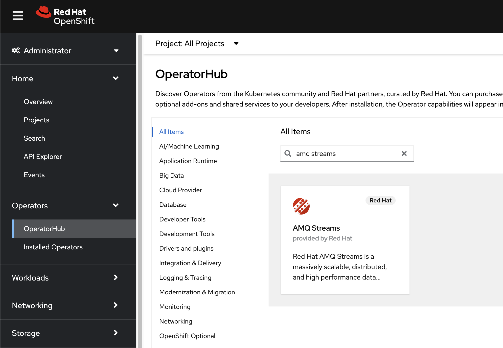

- Select AMQ Streams porvided by Red Hat, Click Install

    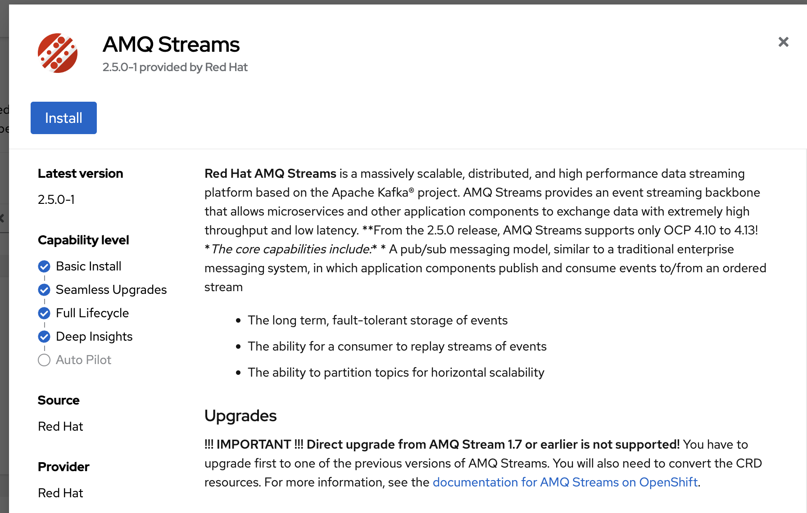

- select update channel to amq-streams-2.2.x
- select installation mode : All namespaces on the cluster (default)
- keep default installed namespace to "openshift-operators"
- select Update approval : Automatic
- click install 

    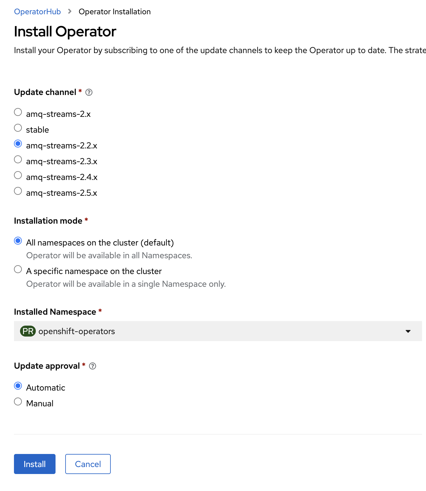

- Wait Until Install Complete

    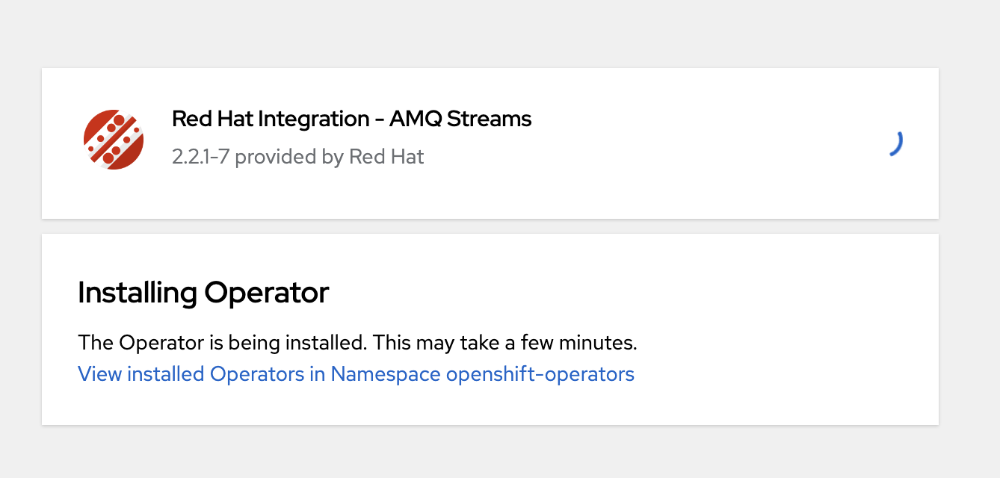

    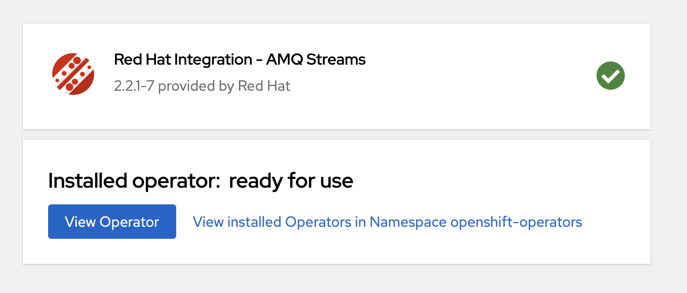

## Install Custom Metrics Autoscaler
- Go to Openshift Console, with Cluster Admin, select Operators, Operator Hub and Search with "Custome Metrics"
    
    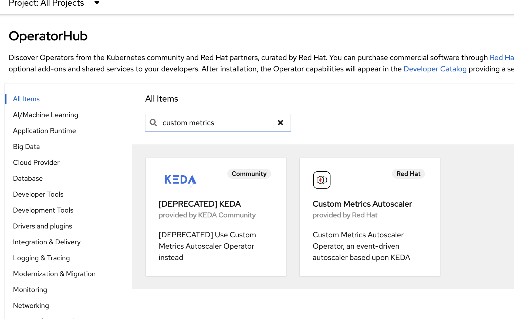

- click Install

    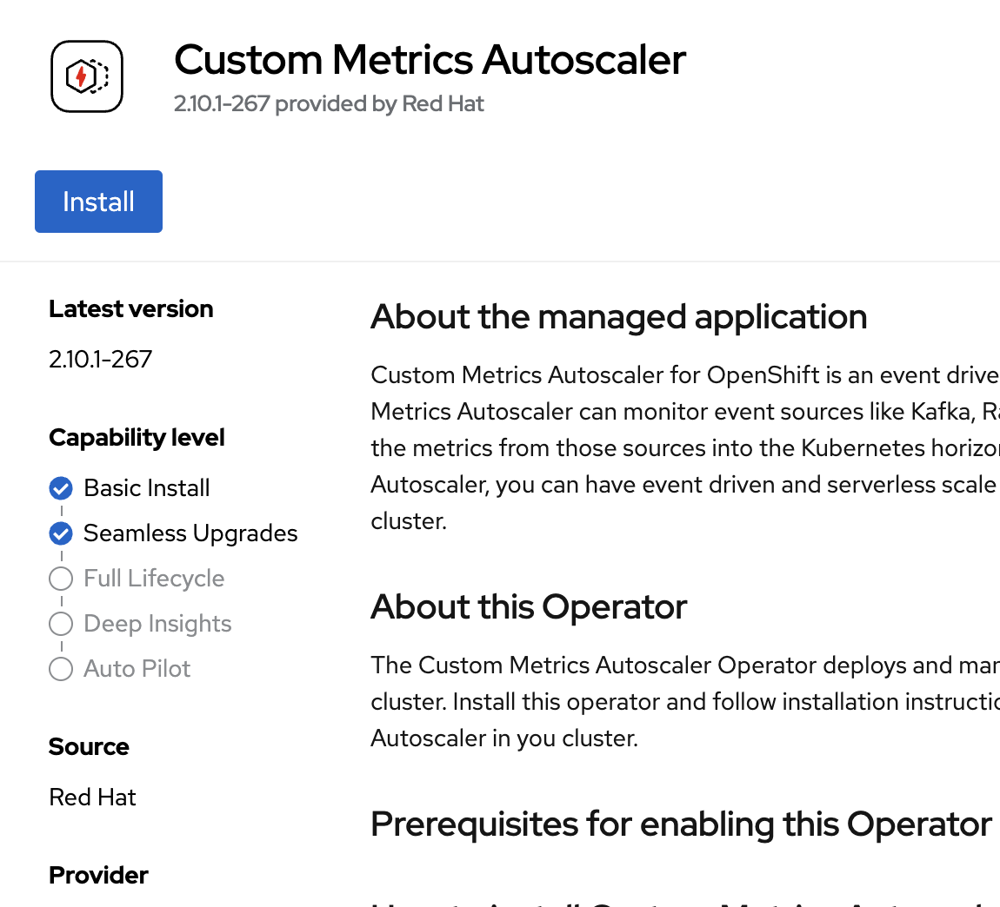

- leave all default, click install
  
    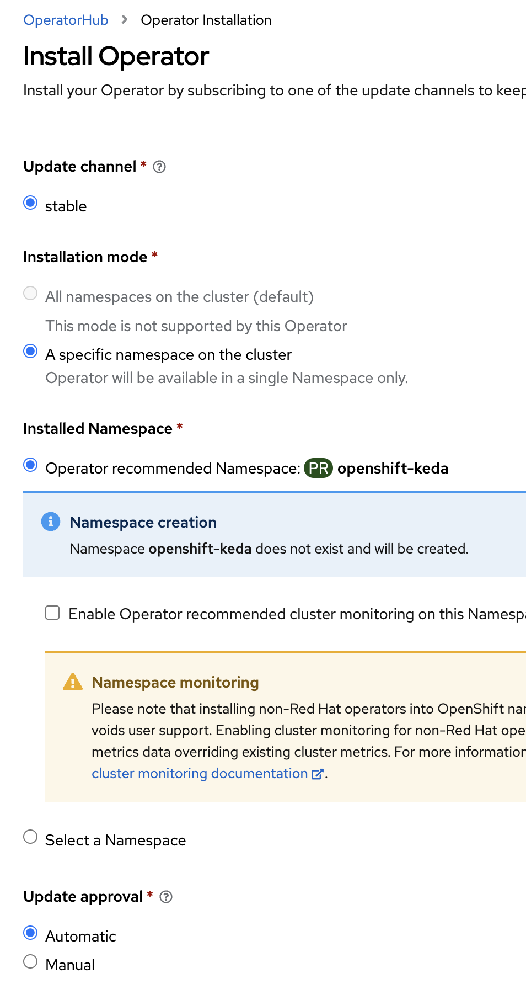

- wait until install complete

    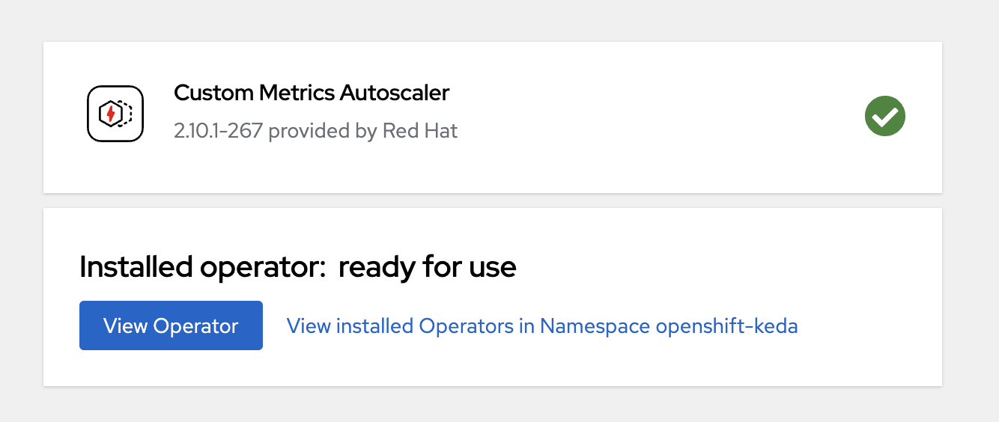

- select project openshift-keda, click tab "KedaController", click Create KedaController

    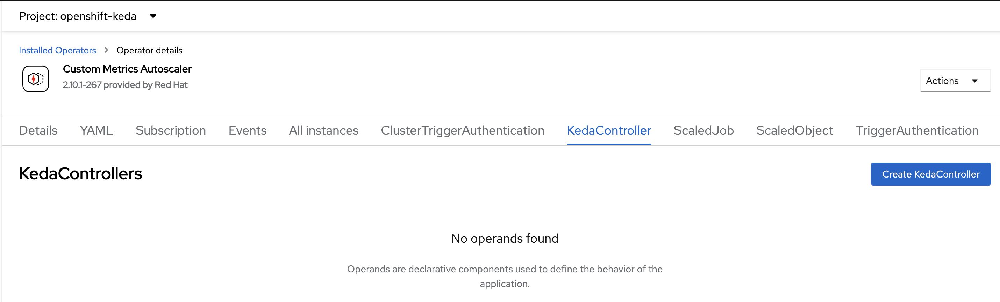

- leave all default value, click Create    

    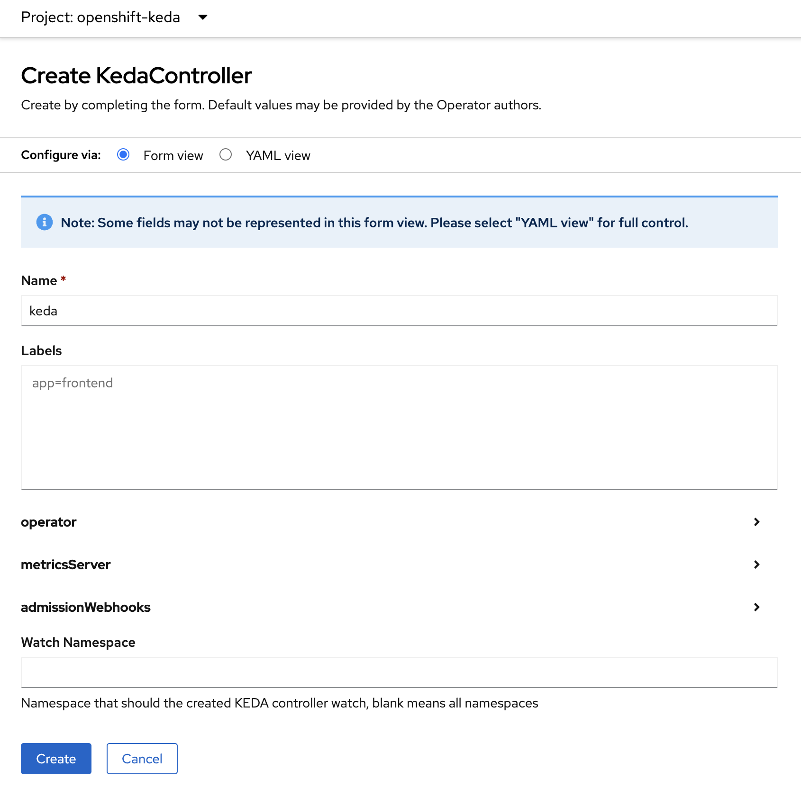

- wait until status change to "Phase: Installation Succeeded"

    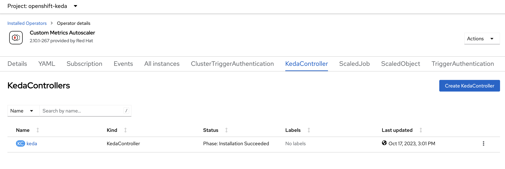


## Setup Application Workload Monitoring

- login oc client with cluster admin user
- Create application workload monitoring configmap

    ```bash
    cd amq-streams-test
    oc apply -f user-workload-monitoring.yml
    oc get po -n openshift-user-workload-monitoring
    ```

- wait until all pod running

    ```bash
    NAME                                  READY   STATUS    RESTARTS   AGE
    prometheus-operator-cf59f9bdc-zmw4v   2/2     Running   0          3h16m
    prometheus-user-workload-0            6/6     Running   0          3h16m
    prometheus-user-workload-1            6/6     Running   0          3h16m
    thanos-ruler-user-workload-0          4/4     Running   0          3h16m
    thanos-ruler-user-workload-1          4/4     Running   0          3h16m
    ```

## Setup User Workshop

- Clone this repository to your computer then go to [script](script/) directory.

- Export lab user password and cluster admin password (the passwords should be there in the mail sent from RHDP). Then run [lab-user-provisioner.sh](script/lab-user-provisioner.sh) script with number of lab users as the script argument.

   For example, provisioning 5 lab users:

   ```sh
   export USER_PASSWORD=openshift
   export ADMIN_PASSWORD=r3dh4t1!
   ./lab-user-provisioner.sh 5
   ```

   **Following projects/namespaces will be created for each user:**
   * user*X*-amqstreams-quickstart
   * user*X*-amqstreams-full